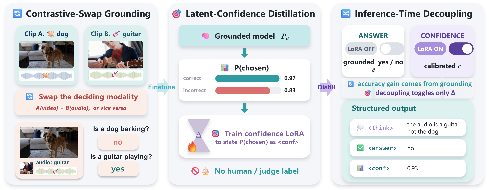

# GRACE: Grounding and Confidence Calibration for Audio-Visual Hallucination

<p align="center">
  
  
  
  <a href="LICENSE"></a>
</p>

<p align="center"></p>

## Setup

```bash
pip install -r requirements.txt
```

Backbones are pulled from the 🤗 Hub on first run:
[`Qwen/Qwen2.5-Omni-7B`](https://huggingface.co/Qwen/Qwen2.5-Omni-7B),
[`openbmb/MiniCPM-o-2_6`](https://huggingface.co/openbmb/MiniCPM-o-2_6).

Download them from their official sources
([VGGSound](https://github.com/hche11/VGGSound), [AVHBench](https://github.com/kaist-ami/AVHBench),
[CMM](https://github.com/DAMO-NLP-SG/CMM)) into `data/`:

```text
data/VGGSound/{vggsound.csv, vgg_label_qa_map.json, video/*.mp4, audio/*.wav}
data/AVHBench/{avhbench_qa.json, videos/*.mp4, audios/*.wav}
data/CMM/{cmm_annotations.jsonl, reorg_raw_files/<category>/<sub_category>/*}
```

## Data

```bash
VGG_CSV=data/VGGSound/vggsound.csv VGG_MAP=data/VGGSound/vgg_label_qa_map.json \
  VGG_VIDEODIR=data/VGGSound/video VGG_AUDIODIR=data/VGGSound/audio \
  VGG_OUT=data/vggsound_train.parquet VGG_SEED=0 \
  python data_prep/build_vggsound_contrastive.py

AF_QA=data/AVHBench/avhbench_qa.json AF_MEDIA=data/AVHBench \
  AF_OUT=data/avhbench_eval.parquet \
  python data_prep/build_avhbench_eval.py

CMM_ANNO=data/CMM/cmm_annotations.jsonl CMM_MEDIA=data/CMM/reorg_raw_files \
  CMM_OUT=data/cmm_eval.parquet \
  python data_prep/build_cmm_eval.py
```

## Training

```bash
# 1) grounding LoRA
WS_DATA=data/vggsound_train.parquet WS_OUT=checkpoints/qwen_grounding/adapter \
  WS_LR=5e-5 WS_ACCUM=8 WS_SEED=0 WS_ANS_WEIGHT=10 WS_LORA_R=32 WS_LORA_ALPHA=16 \
  python train/train_qwen.py

# 2) probe latent P(chosen)
PC_ADAPTER=checkpoints/qwen_grounding/adapter PC_DATA=data/vggsound_train.parquet \
  PC_OUT=data/qwen_probe.json \
  python data_prep/conf_probe_qwen.py

# 3) probe -> confidence targets
CT_TRAIN=data/vggsound_train.parquet CT_PROBE=data/qwen_probe.json \
  CT_OUT=data/vggsound_conftarget.parquet \
  python data_prep/build_conf_target.py

# 4) confidence LoRA
WS_DATA=data/vggsound_conftarget.parquet WS_INIT=checkpoints/qwen_grounding/adapter \
  WS_OUT=checkpoints/qwen_conf/adapter WS_LR=5e-5 WS_ACCUM=8 WS_SEED=0 \
  python train/train_qwen.py
```

MiniCPM-o: `train/train_minicpm.py` with `configs/minicpm_o.yaml`

## Evaluation

```bash
CE_ADAPTER=checkpoints/qwen_grounding/adapter CE_ADAPTER2=checkpoints/qwen_conf/adapter \
  CE_EVAL=data/avhbench_eval.parquet CE_MEDIA_ROOT=data/AVHBench CE_MAXNEW=128 \
  CE_OUT=results/decoupled.json CE_RAW=results/decoupled_raw.jsonl \
  python eval/eval_decoupled.py
```

CMM: set `CE_EVAL=data/cmm_eval.parquet CE_MEDIA_ROOT=data/CMM`. MiniCPM-o: `eval/eval_minicpm.py`.

The two ablation variants use the same script:

```bash
# grounding only: drop CE_ADAPTER2
CE_ADAPTER=checkpoints/qwen_grounding/adapter CE_EVAL=... python eval/eval_decoupled.py

# always-on: confidence LoRA active for the whole response
CE_ALWAYS_ON=1 CE_ADAPTER=... CE_ADAPTER2=... CE_EVAL=... python eval/eval_decoupled.py
```


## Results

| Model | AdVH | VdAH | AVM | Overall | Over-rel. | Spurious | Overall |
|---|:--:|:--:|:--:|:--:|:--:|:--:|:--:|
| **Qwen2.5-Omni-7B** | 80.2 | 73.7 | 51.5 | 68.5 | 71.6 | 86.7 | 79.1 |
| &emsp;+ AVCD | 79.7 | 75.8 | – | – | 73.3 | – | – |
| &emsp;+ MAD | 84.4 | 78.7 | 57.1\* | 75.2 | 81.4 | 90.4\* | 85.3 |
| &emsp;+ OmniDPO | 85.3 | 80.8 | 61.5 | 75.9 | 80.2 | 91.2 | 85.7 |
| &emsp;+ MoD-DPO++ | **88.2** | <ins>83.4</ins> | <ins>69.7</ins> | <ins>80.4</ins> | <ins>83.1</ins> | **93.3** | **88.2** |
| &emsp;**+ GRACE (ours)** | <ins>87.3</ins> | **84.5** | **83.6** | **85.1** | **84.8** | <ins>91.4</ins> | <ins>88.1</ins> |
| **MiniCPM-o 2.6-8B** | 83.4 | 74.6 | 54.3 | 70.8 | 66.5 | 84.4 | 75.5 |
| &emsp;+ AVCD† | 78.5 | 76.6 | <ins>74.9</ins> | 76.4 | 72.3 | 86.6 | 79.4 |
| &emsp;+ MAD† | 82.8 | 79.2 | 71.8 | <ins>77.4</ins> | 79.6 | 89.1 | 84.3 |
| &emsp;+ OmniDPO | 85.0 | 75.4 | 56.9 | 72.4 | <ins>79.8</ins> | 87.2 | 83.5 |
| &emsp;+ MoD-DPO++ | **87.3** | <ins>79.5</ins> | 60.7 | 75.8 | **82.7** | <ins>89.2</ins> | **86.0** |
| &emsp;**+ GRACE (ours)** | <ins>87.0</ins> | **83.6** | **82.1** | **83.8** | 78.3 | **91.7** | <ins>85.0</ins> |


| Model | Acc. (%) ↑ | conf. rate ↑ | ECE ↓ | AUROC ↑ |
|---|:--:|:--:|:--:|:--:|
| MiniCPM-o 2.6-8B | 70.8 | 0.42 | 0.290 | 0.524 |
| Qwen2.5-Omni-3B | 72.4 | 0.27 | 0.386 | 0.346 |
| Qwen2.5-Omni-7B | 72.6 | 0.98 | 0.166 | 0.514 |
| MAD (Qwen2.5-o, α=0.7)† | 75.2 | 0.91 | 0.326 | 0.578 |
| **GRACE (MiniCPM-o)** | 83.8 | 1.00 | 0.080 | 0.695 |
| **GRACE (Qwen2.5-o)** | **85.1** | **1.00** | **0.058** | **0.738** |

## License

The code in this repository is released under the **[MIT License](LICENSE)**.